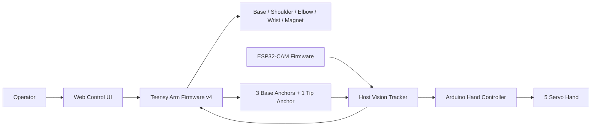
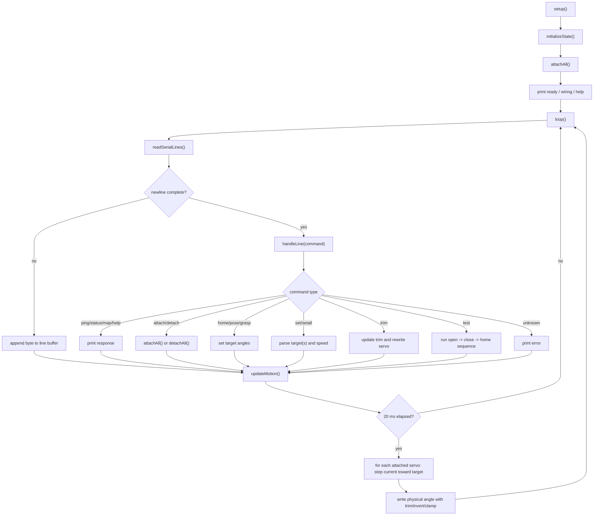
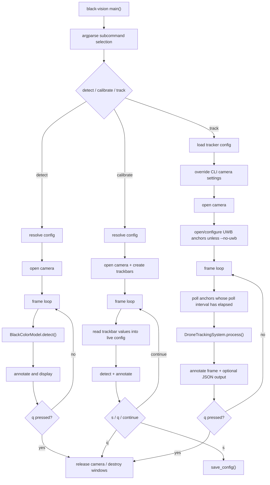
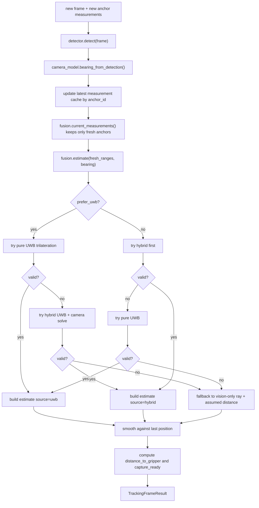
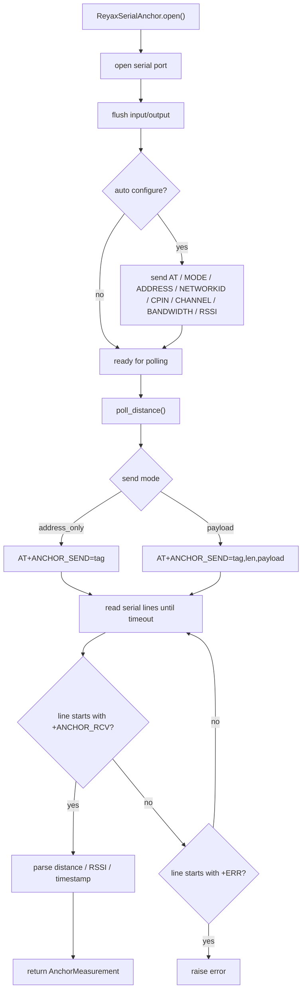
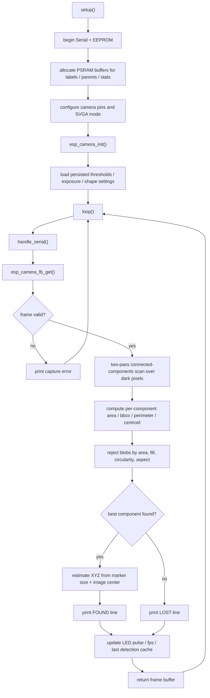
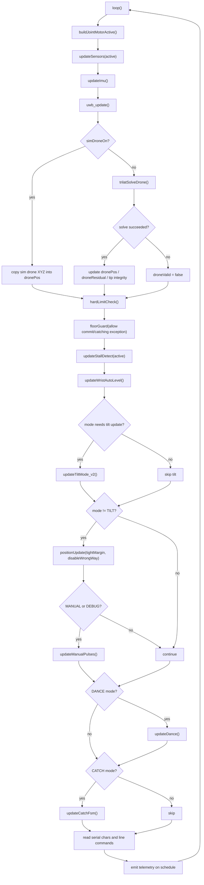
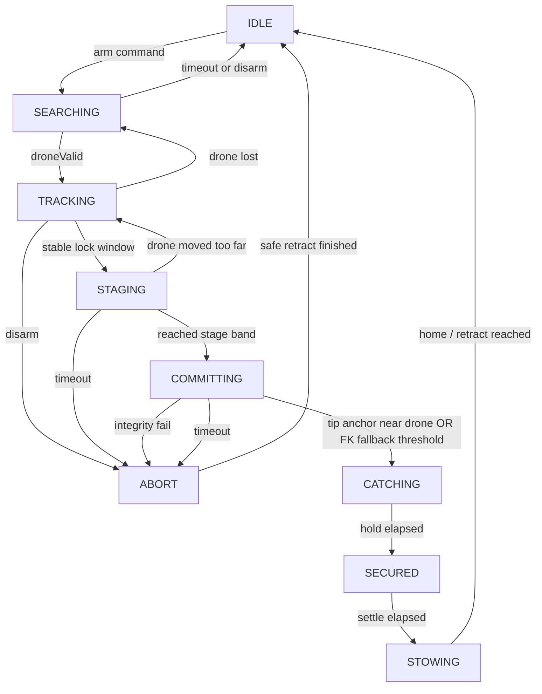
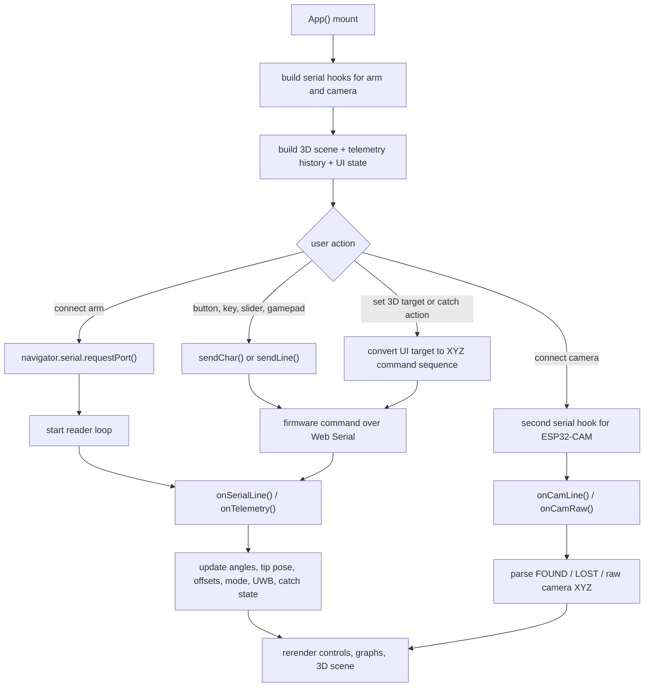
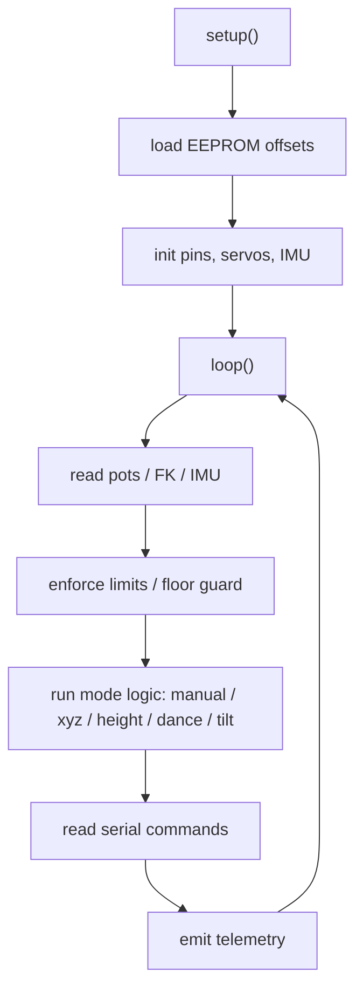

# Drone Catch System Flowcharts

These flowcharts are derived from the current code in:

- [hand/servo_controller/arduino_firmware/hand_servo_controller.ino](/Users/spershgoyal/Documents/Playground/drone-catch-system/hand/servo_controller/arduino_firmware/hand_servo_controller.ino:1)
- [vision/black-vision-tracker/black_vision/cli.py](/Users/spershgoyal/Documents/Playground/drone-catch-system/vision/black-vision-tracker/black_vision/cli.py:1)
- [vision/black-vision-tracker/black_vision/tracking.py](/Users/spershgoyal/Documents/Playground/drone-catch-system/vision/black-vision-tracker/black_vision/tracking.py:1)
- [vision/black-vision-tracker/black_vision/uwb.py](/Users/spershgoyal/Documents/Playground/drone-catch-system/vision/black-vision-tracker/black_vision/uwb.py:1)
- [vision/black-vision-tracker/black_vision/detector.py](/Users/spershgoyal/Documents/Playground/drone-catch-system/vision/black-vision-tracker/black_vision/detector.py:1)
- [vision/esp32_cam_firmware/cam_test_v5.ino](/Users/spershgoyal/Documents/Playground/drone-catch-system/vision/esp32_cam_firmware/cam_test_v5.ino:1)
- [arm/v4_release/arm_v4/arm_v4.ino](/Users/spershgoyal/Documents/Playground/drone-catch-system/arm/v4_release/arm_v4/arm_v4.ino:1)
- [arm/v4_release/arm_v4/catch_fsm.h](/Users/spershgoyal/Documents/Playground/drone-catch-system/arm/v4_release/arm_v4/catch_fsm.h:1)
- [arm/v4_release/arm_v4/serial_cmd.h](/Users/spershgoyal/Documents/Playground/drone-catch-system/arm/v4_release/arm_v4/serial_cmd.h:1)
- [arm/web_control/arm_ctrlv4.html](/Users/spershgoyal/Documents/Playground/drone-catch-system/arm/web_control/arm_ctrlv4.html:1)

## 1. Repository Runtime Topology

## 2. Hand Firmware Flow

This is the actual control loop in `hand_servo_controller.ino`.

## 3. Vision Tracker CLI Flow

This is the entrypoint structure in `cli.py`.

## 4. Per-Frame Detection and Fusion Flow

This is the runtime path inside `DroneTrackingSystem.process()` and `PositionFusionEngine.estimate()`.

## 5. UWB Serial Anchor Flow

This is the live driver behavior in `uwb.py`.

## 6. ESP32-CAM Firmware Flow

This is the logic in `cam_test_v5.ino`.

## 7. Arm v4 Main Loop

This is the actual ordering in `arm_v4.ino`.

## 8. Catch FSM

This is the autonomous catch logic in `catch_fsm.h`.

## 9. Web Control UI Flow

This is the main app-level control/data path in `arm_ctrlv4.html`.

## 10. Legacy Arm v3

The older `arm/teensy_firmware/arm_main_v3p.ino` is a single-file predecessor to v4. Its control structure is simpler:

