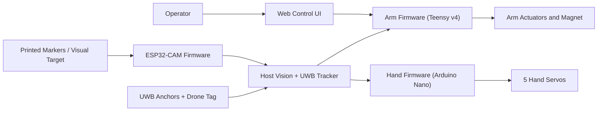

# Drone Catch System Overview Flowchart

```mermaid
flowchart LR
    OP["Operator"] --> WEB["Web Control UI"]
    WEB --> ARM["Arm Firmware (Teensy v4)"]
    ARM --> ACT["Arm Actuators and Magnet"]

    CAM["ESP32-CAM Firmware"] --> HOST["Host Vision + UWB Tracker"]
    UWB["UWB Anchors + Drone Tag"] --> HOST
    HOST --> ARM

    HOST --> HAND["Hand Firmware (Arduino Nano)"]
    HAND --> SERVOS["5 Hand Servos"]

    MARKERS["Printed Markers / Visual Target"] --> CAM
```

